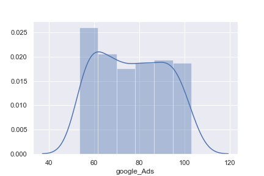
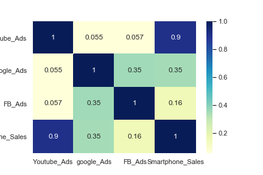
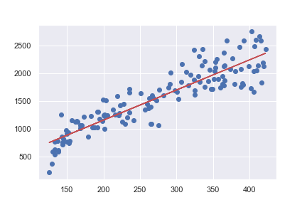

# predicting sales performance

### Overview
A project to predict smartphone sales based on the marketing budget spent on advertising using three platforms involves collecting data on marketing spending and smartphone sales, and using statistical and machine learning techniques to build a model that can predict future smartphone sales based on changes in marketing budgetA project to predict smartphone sales based on the marketing budget spent on advertising using three platforms involves collecting data on marketing spending and smartphone sales, and using statistical and machine learning techniques to build a model that can predict future smartphone sales based on changes in marketing budget

### Data sets

### Approch 
Make a statical analysis and Building a statistical model. 

### EDA 
 The sale distribution is somewhat in a normal distribution. 
 

 

As the sale of Smartphone increase the expenditure of the Youtube Ads also increase. 

</li>
### Correlation matrix

### Model 

#### Goodness of Fit 

#### Test Data 

#### Author

👤 **SABOYE**

* Twitter: [@saboye1](https://twitter.com/saboye1 )
* Github: [@saboye](https://github.com/saboye)

#### 🤝 Contributing

Contributions, issues and feature requests are welcome! Feel free to check [issues page](https://github.com/saboye/predicting-sales-performance/issues).

#### Show your support

Give a ⭐️ if this project helped you!

#### 📝 License

Copyright © 2021 [saboye](https://github.com/saboye). 
This project is [MIT](https://github.com/saboye/predicting-sales-performance/blob/master/LICENSE) licensed.

***
