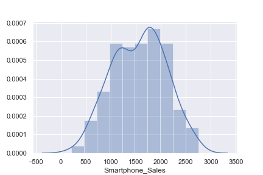
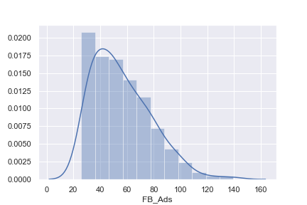
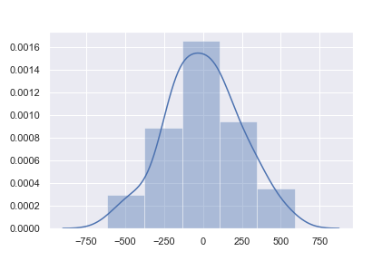
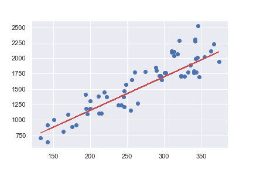

# predicting sales performance

### Overview
This Project will be predicting the sales of smartphones based on the marketing spending on the Ads on a different platform. 

### Data sets

### Approch 
Make a statical analysis and Building a statistical model. 

### EDA 
 The sale distribution is somewhat in a normal distribution. 
 

 

As the sale of Smartphone increase the expenditure of the Youtube Ads also increase. 

</li>

#### Author

👤 **SABOYE**

* Twitter: [@saboye1](https://twitter.com/saboye1 )
* Github: [@saboye](https://github.com/saboye)

#### 🤝 Contributing

Contributions, issues and feature requests are welcome! Feel free to check [issues page](https://github.com/saboye/predicting-sales-performance/issues).

#### Show your support

Give a ⭐️ if this project helped you!

#### 📝 License

Copyright © 2021 [saboye](https://github.com/saboye). 
This project is [MIT](https://github.com/saboye/predicting-sales-performance/blob/master/LICENSE) licensed.

***
